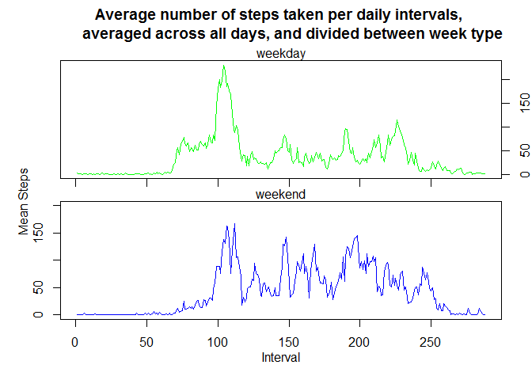

Introduction
------------

This assignment makes use of data from a personal activity monitoring
device. This device collects data of number of steps taken at 5 minute
intervals through out the day. The data consists of two months of data
from an anonymous individual collected during the months of October and
November 2012.

The following analysis works on answering a few key exploratory
questions:

-   What is mean, median, and total number of steps taken per day?
-   What is the average daily activity pattern?
-   How to impute missing values?
-   What differences are there between the original and imputed data?
-   Are there differences in activity patterns between weekdays and
    weekends?

Analysis
--------

### Preprocessing

#### Reading Data

Downloading and reading the activity monitoring data

    URL <- "https://d396qusza40orc.cloudfront.net/repdata%2Fdata%2Factivity.zip"
    download.file(URL, "zip", method = "curl")
    file <- unzip("zip")
    A <- read.csv(file)

#### NA Values

Ignoring NA Values in entire dataset

    A0 <- na.omit(A)
    A0$date <- droplevels(A0$date)

**Note**, as consequence of removing NA values, the following days were
completely removed from Date column in 'A0', as they had only NA values.
These days will not taken into account for the first calculations of
this assignment.

    days.kept <- which(unique(A$date) %in% unique(A0$date))
    days.removed <- as.Date(unique(A$date)[-days.kept])
    days.removed

    ## [1] "2012-10-01" "2012-10-08" "2012-11-01" "2012-11-04" "2012-11-09"
    ## [6] "2012-11-10" "2012-11-14" "2012-11-30"

### Calculations on Number of Steps per Day

#### Total Steps

Calculating the total number of steps taken per day

    totalByday <- aggregate(A0$steps, list(A0$date), sum)
    colnames(totalByday) <- c("Date", "Total Steps")
    totalByday

    ##          Date Total Steps
    ## 1  2012-10-02         126
    ## 2  2012-10-03       11352
    ## 3  2012-10-04       12116
    ## 4  2012-10-05       13294
    ## 5  2012-10-06       15420
    ## 6  2012-10-07       11015
    ## 7  2012-10-09       12811
    ## 8  2012-10-10        9900
    ## 9  2012-10-11       10304
    ## 10 2012-10-12       17382
    ## 11 2012-10-13       12426
    ## 12 2012-10-14       15098
    ## 13 2012-10-15       10139
    ## 14 2012-10-16       15084
    ## 15 2012-10-17       13452
    ## 16 2012-10-18       10056
    ## 17 2012-10-19       11829
    ## 18 2012-10-20       10395
    ## 19 2012-10-21        8821
    ## 20 2012-10-22       13460
    ## 21 2012-10-23        8918
    ## 22 2012-10-24        8355
    ## 23 2012-10-25        2492
    ## 24 2012-10-26        6778
    ## 25 2012-10-27       10119
    ## 26 2012-10-28       11458
    ## 27 2012-10-29        5018
    ## 28 2012-10-30        9819
    ## 29 2012-10-31       15414
    ## 30 2012-11-02       10600
    ## 31 2012-11-03       10571
    ## 32 2012-11-05       10439
    ## 33 2012-11-06        8334
    ## 34 2012-11-07       12883
    ## 35 2012-11-08        3219
    ## 36 2012-11-11       12608
    ## 37 2012-11-12       10765
    ## 38 2012-11-13        7336
    ## 39 2012-11-15          41
    ## 40 2012-11-16        5441
    ## 41 2012-11-17       14339
    ## 42 2012-11-18       15110
    ## 43 2012-11-19        8841
    ## 44 2012-11-20        4472
    ## 45 2012-11-21       12787
    ## 46 2012-11-22       20427
    ## 47 2012-11-23       21194
    ## 48 2012-11-24       14478
    ## 49 2012-11-25       11834
    ## 50 2012-11-26       11162
    ## 51 2012-11-27       13646
    ## 52 2012-11-28       10183
    ## 53 2012-11-29        7047

#### Histogram

Plotting a histogram of the total number of steps taken each day

    hist(totalByday[, "Total Steps"], 
         main = "Frequency of Total Number of Steps taken each Day",
         xlab = "Total Steps each Day")

#### Mean Steps

Calculating the mean of the total number of steps taken per day

    meanByday <- aggregate(A0$steps, list(A0$date), mean)
    colnames(meanByday) <- c("Date", "Mean Steps")
    meanByday[, "Mean Steps"] <- round(meanByday[, "Mean Steps"], 2)
    meanByday

    ##          Date Mean Steps
    ## 1  2012-10-02       0.44
    ## 2  2012-10-03      39.42
    ## 3  2012-10-04      42.07
    ## 4  2012-10-05      46.16
    ## 5  2012-10-06      53.54
    ## 6  2012-10-07      38.25
    ## 7  2012-10-09      44.48
    ## 8  2012-10-10      34.38
    ## 9  2012-10-11      35.78
    ## 10 2012-10-12      60.35
    ## 11 2012-10-13      43.15
    ## 12 2012-10-14      52.42
    ## 13 2012-10-15      35.20
    ## 14 2012-10-16      52.38
    ## 15 2012-10-17      46.71
    ## 16 2012-10-18      34.92
    ## 17 2012-10-19      41.07
    ## 18 2012-10-20      36.09
    ## 19 2012-10-21      30.63
    ## 20 2012-10-22      46.74
    ## 21 2012-10-23      30.97
    ## 22 2012-10-24      29.01
    ## 23 2012-10-25       8.65
    ## 24 2012-10-26      23.53
    ## 25 2012-10-27      35.14
    ## 26 2012-10-28      39.78
    ## 27 2012-10-29      17.42
    ## 28 2012-10-30      34.09
    ## 29 2012-10-31      53.52
    ## 30 2012-11-02      36.81
    ## 31 2012-11-03      36.70
    ## 32 2012-11-05      36.25
    ## 33 2012-11-06      28.94
    ## 34 2012-11-07      44.73
    ## 35 2012-11-08      11.18
    ## 36 2012-11-11      43.78
    ## 37 2012-11-12      37.38
    ## 38 2012-11-13      25.47
    ## 39 2012-11-15       0.14
    ## 40 2012-11-16      18.89
    ## 41 2012-11-17      49.79
    ## 42 2012-11-18      52.47
    ## 43 2012-11-19      30.70
    ## 44 2012-11-20      15.53
    ## 45 2012-11-21      44.40
    ## 46 2012-11-22      70.93
    ## 47 2012-11-23      73.59
    ## 48 2012-11-24      50.27
    ## 49 2012-11-25      41.09
    ## 50 2012-11-26      38.76
    ## 51 2012-11-27      47.38
    ## 52 2012-11-28      35.36
    ## 53 2012-11-29      24.47

#### Median Steps

Calculating the median of the total number of steps taken per day

    medianByday <- aggregate(A0$steps, list(A0$date), median)
    colnames(medianByday) <- c("Date", "Median Steps")
    medianByday

    ##          Date Median Steps
    ## 1  2012-10-02            0
    ## 2  2012-10-03            0
    ## 3  2012-10-04            0
    ## 4  2012-10-05            0
    ## 5  2012-10-06            0
    ## 6  2012-10-07            0
    ## 7  2012-10-09            0
    ## 8  2012-10-10            0
    ## 9  2012-10-11            0
    ## 10 2012-10-12            0
    ## 11 2012-10-13            0
    ## 12 2012-10-14            0
    ## 13 2012-10-15            0
    ## 14 2012-10-16            0
    ## 15 2012-10-17            0
    ## 16 2012-10-18            0
    ## 17 2012-10-19            0
    ## 18 2012-10-20            0
    ## 19 2012-10-21            0
    ## 20 2012-10-22            0
    ## 21 2012-10-23            0
    ## 22 2012-10-24            0
    ## 23 2012-10-25            0
    ## 24 2012-10-26            0
    ## 25 2012-10-27            0
    ## 26 2012-10-28            0
    ## 27 2012-10-29            0
    ## 28 2012-10-30            0
    ## 29 2012-10-31            0
    ## 30 2012-11-02            0
    ## 31 2012-11-03            0
    ## 32 2012-11-05            0
    ## 33 2012-11-06            0
    ## 34 2012-11-07            0
    ## 35 2012-11-08            0
    ## 36 2012-11-11            0
    ## 37 2012-11-12            0
    ## 38 2012-11-13            0
    ## 39 2012-11-15            0
    ## 40 2012-11-16            0
    ## 41 2012-11-17            0
    ## 42 2012-11-18            0
    ## 43 2012-11-19            0
    ## 44 2012-11-20            0
    ## 45 2012-11-21            0
    ## 46 2012-11-22            0
    ## 47 2012-11-23            0
    ## 48 2012-11-24            0
    ## 49 2012-11-25            0
    ## 50 2012-11-26            0
    ## 51 2012-11-27            0
    ## 52 2012-11-28            0
    ## 53 2012-11-29            0

**Note**, median values are all zero (0). This might seem strange given
the mean calculations were not near zero (0). It is important to recall
that the median is the center value of an ordered distribution. This
dataset has an overwhelming predominance of zeros in the distrubion of
steps taken.

    hist(A0$steps, breaks = 100, xlab = "Number of Steps",
         main = "Frequency of Number of Steps in 8-step Intervals")

And even when zooming into the first 200 steps, to get a better picture
of the gross of the distribution, steps not taken (0) are outpacingly
more frequent than other values.

    hist(A0$steps, breaks = 100, xlim = c(0, 200), xlab = "Number of Steps",
         main = "Frequency of Number of Steps (between 0 and 200 steps) 
         in 2-step Intervals")

Evidently, there are enough zeros for the distribution of steps per day,
when ordered, to have a zero in its middle value, or median.

### Daily Activity Pattern

#### Time Series Plot

Making a time series plot of the 5-minute interval (x-axis) and the
average number of steps taken, averaged across all days (y-axis)

    meanByinterval <- aggregate(A0$steps, list(A0$interval), mean)
    colnames(meanByinterval) <- c("Interval", "Mean Steps")
    meanByinterval[, "Mean Steps"] <- round(meanByinterval[, "Mean Steps"], 2)
    plot(meanByinterval, type = "l", 
         main = "Average number of steps taken per daily intervals, 
         averaged across all days")
    points(x=835, y=206.17)
    text(x=835, y=206.17, "x=835, y=206.17",pos=4, cex=0.8)

#### Greatest Step Interval

Finding the 5-minute interval which, on average across all the days in
the dataset, contains the maximum number of steps

    max <- which.max(meanByinterval[, "Mean Steps"])
    meanByinterval[max, ]

    ##     Interval Mean Steps
    ## 104      835     206.17

### Imputing Missing Values and Comparing Imputed to Omitted Datasets

#### Reporting Missing Values

Calculating and reporting the total number of missing values in steps

    sum(is.na(A$steps))

    ## [1] 2304

#### Imputation Method Selection

Imputation methods, such as regression imputation, offer more precise
values (less noisy) than simpler methods. Unfortunately most multiple
and stochastic imputation techniques require multiple variables useful
for predicting the missing value. These methods are not applicable for a
data set that only has one numeric variable 'steps' and two variables
'date' and 'interval' that do not offer numerical information in terms
of 'steps'. Both are practically categorical values.

Three other methods are possible. For one, the median value of steps per
interval or days. As seen before, the median values by both interval and
date grouping would lead to impute 0 values in all NA values.

    head(aggregate(A0$steps, list(A0$date), median), 5)

    ##      Group.1 x
    ## 1 2012-10-02 0
    ## 2 2012-10-03 0
    ## 3 2012-10-04 0
    ## 4 2012-10-05 0
    ## 5 2012-10-06 0

    head(aggregate(A0$steps, list(A0$interval), median), 5)

    ##   Group.1 x
    ## 1       0 0
    ## 2       5 0
    ## 3      10 0
    ## 4      15 0
    ## 5      20 0

Another possibility is to use the mean value of steps per days. This
method carries great error (standard deviation) as throughout the day
the steps per interval behave very differently. It is simply illogical
to impute a mean value for an entire day in the space of a 5 minute
interval missing value.

    head(aggregate(A0$steps, list(A0$date), sd), 5)

    ##      Group.1          x
    ## 1 2012-10-02   6.912816
    ## 2 2012-10-03 111.897882
    ## 3 2012-10-04 108.601541
    ## 4 2012-10-05 120.916458
    ## 5 2012-10-06 121.204632

Lastly, the best method available is to calculate the mean value of
steps per interval across all days, just as was shown in the prior time
series plot. Here, the variation between intervals is much lower.

    head(aggregate(A0$steps, list(A0$interval), sd), 5)

    ##   Group.1         x
    ## 1       0 7.9768351
    ## 2       5 2.4724902
    ## 3      10 0.9615239
    ## 4      15 1.0988845
    ## 5      20 0.5494423

It is pressumable then that activity (steps) throughout the day is
similar from on day to the next, making this method the most appropiate
and logical to impute missing values (NA).

#### Missing Value Imputation

The row location of the NAs and their respective interval are
determined.

    nas <- which(is.na(A$steps))
    int <- A[nas, "interval"]

Then, the mean per according interval (calculated previously into object
'meanByinterval') is saved in another vector.

    mean <- sapply(int, function(x) {
      subset(meanByinterval, Interval == x, "Mean Steps")
      })
    mean <- as.vector(unlist(mean))

Finally, each NA value has its according mean per interval value imputed
in a new dataset called 'A1'.

    A1 <- A
    A1[nas, ]$steps <- mean

#### Difference between 'A0' (missing values omitted) and 'A1' (missing values imputed)

The following graphs and statistics on 'A1' (dataset with imputed
missing values) are compared to the previous plots and calculations in
order to compare the effect of missing value imputation.

#### Comparing Histograms

Plotting two histograms of the total number of steps taken each day

    par(mfrow = c(1, 2))
    totalByday.1 <- aggregate(A1$steps, list(A1$date), sum)
    colnames(totalByday.1) <- c("Date", "Total Steps")
    hist(totalByday.1[, "Total Steps"],
         xlab = "", 
         main = "",
         ylim = c(0,40))
    title("A1 (missing values imputed)", cex.main = 0.75,line = 0)

    totalByday <- aggregate(A0$steps, list(A0$date), sum)
    colnames(totalByday) <- c("Date", "Total Steps")
    hist(totalByday[, "Total Steps"],
         xlab = "", 
         main = "",
         ylim = c(0,40))
    title("A0 (missing values omitted)", cex.main = 0.75,line = 0)

    par(mfrow = c(1, 1))
    mtext("Frequency of Total Number of Steps taken each Day", side = 3, line = 2)
    mtext("Total Steps each Day", side = 1, line = 3)

#### Comparing Mean and Median

Reporting the mean and median of the total number of steps per day for
'A0' and 'A1'.

**Note**: In order to compare mean and median, merging the both datasets
by the 'date' column is useful. However, the omission of rows with NA
values caused dataset 'A0' to shrink from 17568 to 15264 rows. Dataset
'A' was used for these calculations, instead of 'A0', in order to pair
up the rows perfectly by date.

#### Comparing Mean

    meanByday <- aggregate(A$steps, list(A$date), mean)
    colnames(meanByday) <- c("Date", "Mean Steps")
    meanByday[, "Mean Steps"] <- round(meanByday[, "Mean Steps"], 2)

    meanByday.1 <- aggregate(A1$steps, list(A1$date), mean)
    colnames(meanByday.1) <- c("Date", "Mean Steps with Imputation")
    meanByday.1[, "Mean Steps with Imputation"] <- round(meanByday.1[, "Mean Steps with Imputation"], 2)

    merge(meanByday, meanByday.1, by="Date")

    ##          Date Mean Steps Mean Steps with Imputation
    ## 1  2012-10-01         NA                      37.38
    ## 2  2012-10-02       0.44                       0.44
    ## 3  2012-10-03      39.42                      39.42
    ## 4  2012-10-04      42.07                      42.07
    ## 5  2012-10-05      46.16                      46.16
    ## 6  2012-10-06      53.54                      53.54
    ## 7  2012-10-07      38.25                      38.25
    ## 8  2012-10-08         NA                      37.38
    ## 9  2012-10-09      44.48                      44.48
    ## 10 2012-10-10      34.38                      34.38
    ## 11 2012-10-11      35.78                      35.78
    ## 12 2012-10-12      60.35                      60.35
    ## 13 2012-10-13      43.15                      43.15
    ## 14 2012-10-14      52.42                      52.42
    ## 15 2012-10-15      35.20                      35.20
    ## 16 2012-10-16      52.38                      52.38
    ## 17 2012-10-17      46.71                      46.71
    ## 18 2012-10-18      34.92                      34.92
    ## 19 2012-10-19      41.07                      41.07
    ## 20 2012-10-20      36.09                      36.09
    ## 21 2012-10-21      30.63                      30.63
    ## 22 2012-10-22      46.74                      46.74
    ## 23 2012-10-23      30.97                      30.97
    ## 24 2012-10-24      29.01                      29.01
    ## 25 2012-10-25       8.65                       8.65
    ## 26 2012-10-26      23.53                      23.53
    ## 27 2012-10-27      35.14                      35.14
    ## 28 2012-10-28      39.78                      39.78
    ## 29 2012-10-29      17.42                      17.42
    ## 30 2012-10-30      34.09                      34.09
    ## 31 2012-10-31      53.52                      53.52
    ## 32 2012-11-01         NA                      37.38
    ## 33 2012-11-02      36.81                      36.81
    ## 34 2012-11-03      36.70                      36.70
    ## 35 2012-11-04         NA                      37.38
    ## 36 2012-11-05      36.25                      36.25
    ## 37 2012-11-06      28.94                      28.94
    ## 38 2012-11-07      44.73                      44.73
    ## 39 2012-11-08      11.18                      11.18
    ## 40 2012-11-09         NA                      37.38
    ## 41 2012-11-10         NA                      37.38
    ## 42 2012-11-11      43.78                      43.78
    ## 43 2012-11-12      37.38                      37.38
    ## 44 2012-11-13      25.47                      25.47
    ## 45 2012-11-14         NA                      37.38
    ## 46 2012-11-15       0.14                       0.14
    ## 47 2012-11-16      18.89                      18.89
    ## 48 2012-11-17      49.79                      49.79
    ## 49 2012-11-18      52.47                      52.47
    ## 50 2012-11-19      30.70                      30.70
    ## 51 2012-11-20      15.53                      15.53
    ## 52 2012-11-21      44.40                      44.40
    ## 53 2012-11-22      70.93                      70.93
    ## 54 2012-11-23      73.59                      73.59
    ## 55 2012-11-24      50.27                      50.27
    ## 56 2012-11-25      41.09                      41.09
    ## 57 2012-11-26      38.76                      38.76
    ## 58 2012-11-27      47.38                      47.38
    ## 59 2012-11-28      35.36                      35.36
    ## 60 2012-11-29      24.47                      24.47
    ## 61 2012-11-30         NA                      37.38

#### Comparing Median

    medianByday <- aggregate(A$steps, list(A$date), median)
    colnames(medianByday) <- c("Date", "Median Steps")
    medianByday[, "Median Steps"] <- round(medianByday[, "Median Steps"], 2)

    medianByday.1 <- aggregate(A1$steps, list(A1$date), median)
    colnames(medianByday.1) <- c("Date", "Median Steps with Imputation")
    medianByday.1[, "Median Steps with Imputation"] <- round(medianByday.1[, "Median Steps with Imputation"], 2)

    merge(medianByday, medianByday.1, by="Date")

    ##          Date Median Steps Median Steps with Imputation
    ## 1  2012-10-01           NA                        34.12
    ## 2  2012-10-02            0                         0.00
    ## 3  2012-10-03            0                         0.00
    ## 4  2012-10-04            0                         0.00
    ## 5  2012-10-05            0                         0.00
    ## 6  2012-10-06            0                         0.00
    ## 7  2012-10-07            0                         0.00
    ## 8  2012-10-08           NA                        34.12
    ## 9  2012-10-09            0                         0.00
    ## 10 2012-10-10            0                         0.00
    ## 11 2012-10-11            0                         0.00
    ## 12 2012-10-12            0                         0.00
    ## 13 2012-10-13            0                         0.00
    ## 14 2012-10-14            0                         0.00
    ## 15 2012-10-15            0                         0.00
    ## 16 2012-10-16            0                         0.00
    ## 17 2012-10-17            0                         0.00
    ## 18 2012-10-18            0                         0.00
    ## 19 2012-10-19            0                         0.00
    ## 20 2012-10-20            0                         0.00
    ## 21 2012-10-21            0                         0.00
    ## 22 2012-10-22            0                         0.00
    ## 23 2012-10-23            0                         0.00
    ## 24 2012-10-24            0                         0.00
    ## 25 2012-10-25            0                         0.00
    ## 26 2012-10-26            0                         0.00
    ## 27 2012-10-27            0                         0.00
    ## 28 2012-10-28            0                         0.00
    ## 29 2012-10-29            0                         0.00
    ## 30 2012-10-30            0                         0.00
    ## 31 2012-10-31            0                         0.00
    ## 32 2012-11-01           NA                        34.12
    ## 33 2012-11-02            0                         0.00
    ## 34 2012-11-03            0                         0.00
    ## 35 2012-11-04           NA                        34.12
    ## 36 2012-11-05            0                         0.00
    ## 37 2012-11-06            0                         0.00
    ## 38 2012-11-07            0                         0.00
    ## 39 2012-11-08            0                         0.00
    ## 40 2012-11-09           NA                        34.12
    ## 41 2012-11-10           NA                        34.12
    ## 42 2012-11-11            0                         0.00
    ## 43 2012-11-12            0                         0.00
    ## 44 2012-11-13            0                         0.00
    ## 45 2012-11-14           NA                        34.12
    ## 46 2012-11-15            0                         0.00
    ## 47 2012-11-16            0                         0.00
    ## 48 2012-11-17            0                         0.00
    ## 49 2012-11-18            0                         0.00
    ## 50 2012-11-19            0                         0.00
    ## 51 2012-11-20            0                         0.00
    ## 52 2012-11-21            0                         0.00
    ## 53 2012-11-22            0                         0.00
    ## 54 2012-11-23            0                         0.00
    ## 55 2012-11-24            0                         0.00
    ## 56 2012-11-25            0                         0.00
    ## 57 2012-11-26            0                         0.00
    ## 58 2012-11-27            0                         0.00
    ## 59 2012-11-28            0                         0.00
    ## 60 2012-11-29            0                         0.00
    ## 61 2012-11-30           NA                        34.12

Both the median and mean value for 'A1' do not differ from the original
dataset 'A'. All values are identical, expect for, of course, the NA
values which are now imputed values. This suggests that all NA values
were found in entire days, not spread apart between days. (Remember, the
mean and median were aggregated based on each day.) This congruent with
the previous observation that, when NA values where omitted from 'A'
into 'A0', entire days were excluded. This imputation proves
unproblematic for the mean calculation, but not for the median. For the
median, it does not take into account the overwhelming number of zeros
found in other days, because the only values imputed were the mean steps
per interval. Thus, this imputation is not efficient for the median. For
the mean, given it is a central statistic that prioritizes the weight of
observations over their position (order), the imputed values are
reasonable to the behaviour of all other days.

### Differences between weekdays and weekends

#### Calling each day by Week Type

Create a new factor variable in the dataset with two levels –
“weekday” and “weekend”

    week <- function(x) {
      y <- vector()
    if(weekdays(as.Date(x)) == "Saturday") {
          y <- c(y, "weekend")
      } else if(weekdays(as.Date(x)) == "Sunday") {
          y <- c(y, "weekend")
      } else {
          y <- c(y, "weekday")
      }
    return(y)
    }

    w <- as.factor(sapply(A1$date, week))
    A1[, "weektype"] <- w    

#### Comparing weekdays and weekends activity

Plotting a paneled time series plot to compare the steps per interval,
averaged across days, between weekdays and weekends.

    meanByweektype <- aggregate(A1$steps, list(A1$interval, A1$weektype), mean)
    colnames(meanByweektype) <- c("Interval", "Week_Type", "Mean Steps")
    meanByweekday <- subset(meanByweektype, Week_Type == "weekday")
    meanByweekend <- subset(meanByweektype, Week_Type == "weekend")

    par(mfrow = c(2, 1))
    par(mar = c(0, 0, 1.5, 0), oma = c(4, 4, 2.5, 2))
    plot(meanByweekday[, "Mean Steps"], type = "l", col = "green", axes = F) 
    box()
    mtext("weekday", 3)
    axis(side = 4)
    axis(side = 1, labels = F)
    plot(meanByweekend[, "Mean Steps"], type = "l", col = "blue", ylim = c(0, 200))
    mtext("weekend", 3)

    par(mfrow = c(1, 1))
    title("Average number of steps taken per daily intervals, 
          averaged across all days, and divided between week type", line = 0, outer = T)
    mtext("Mean Steps", 2, 2)
    mtext("Interval", 1, 2)

There is a noticeable increase in the height of peaks across all
intervals for the weekend activity. The number of steps during the
weekend also as sharper valleys, meaning the time (in 5-minute
intervals) spent taking less steps is clearly reduced. Observe the
valley between intervals 100 and 150. The weekday panel has a clear
descent, stable valley, and the ascend into another pear. On the
contrary, the weekend panel has a very rapid descent, short valley,
ascend to another peak, and many mini peaks and valleys before the next
great ascend around interval 150. This same difference in sharpness of
average steps per interval can be observed around the 200 inteval. The
only case where weekday proves more activity than weekend is around the
225 interval. Other than this, weekends are definitely more active.
